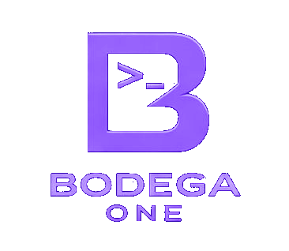

<p align="center">
  
</p>

<h3 align="center">Bodega One Code — the local-first AI coding agent for your terminal</h3>

<p align="center">
  <a href="https://github.com/BodegaoneAI/bodegaone-cli-releases/releases/latest">Download</a>
  ·
  <a href="CHANGELOG.md">Changelog</a>
  ·
  <a href="https://bodegaone.ai">bodegaone.ai</a>
</p>

---

Binary distribution for **Bodega One Code**, the terminal surface of [Bodega One](https://bodegaone.ai) — a local-first AI coding agent that runs on your machine, against your models, and checks its own work. The source lives in a separate private repo. This repo carries the built bundles, checksums, install scripts, and the self-update manifests.

## What is Bodega One Code?

An agentic coding CLI with an interactive terminal session and a headless mode for scripts and CI. It spawns its own bundled backend (Node runtime included — nothing to install first) and works two ways:

- **Your keys**: OpenAI, Anthropic, Google, and 20+ other providers, using API keys you already have. No account with us, no metering, no monthly token anxiety.
- **No keys at all**: point it at local models. `bodega models` installs Ollama, recommends models that actually fit your GPU, and pulls them — from zero to a working local coding agent in one command.

What it does that other coding CLIs don't:

- **Verified output.** Every agentic run is scored by the Quality Enforcement Layer — contract extracted from your request, code compiled, tests run, result probed. `bodega run` derives its exit code from the verification, so your scripts can trust it.
- **A real air-gap.** Flip air-gap mode and zero bytes leave your machine — enforced in the engine, not promised in a privacy policy.
- **Fleet runs.** `bodega fleet "task" --split 3` races the same task in parallel isolated worktrees and recommends the winner by verification score.
- **One shared brain.** Keys, settings, sessions, and MCP servers are shared with the Bodega One desktop app and agent — configure once, use everywhere.
- **Windows-first.** Native. No WSL required, ever.

## Features

**The agent**
- **Interactive session + headless mode** a full terminal REPL for working alongside the agent, and `bodega run` for scripts and CI.
- **Verified output** every agentic run is scored by the Quality Enforcement Layer: a contract is extracted from your request, the code is compiled, your tests are run, and the result is booted and probed. `bodega run` derives its exit code from that verification, so your scripts can trust it.
- **Fleet runs** `bodega fleet "task" --split 3` races the same task in parallel isolated worktrees and recommends the winner by verification score.
- **Loops** schedule agentic tasks that run on a cron or interval and only apply when they pass verification.

**Your models**
- **Bring your keys** OpenAI, Anthropic, Google, and 20+ other providers, using API keys you already have. No account with us, no metering.
- **Or no keys at all** point it at local models. `bodega models` installs Ollama, recommends models that fit your GPU, and pulls them, from zero to a working local coding agent in one command.

**Private and safe by design**
- **A real air-gap** flip air-gap mode and zero bytes leave your machine, enforced in the engine, not promised in a policy.
- **Workspace trust** a cloned repo's committed config cannot register tools or run its own commands until you approve them once, and it re-asks if the command changes.
- **Secrets stay home** `--trace` and `session export` redact API keys, tokens, and private keys found in tool output before anything is written to disk.
- **Machine policy** an administrator can force air-gap on, extend the deny list, or disable the repair loop; a session can only get stricter, never looser.
- **Zero telemetry** no analytics, no phone-home.

**Fits your setup**
- **One shared brain** keys, settings, sessions, and MCP servers are shared with the Bodega One desktop app and agent: configure once, use everywhere.
- **MCP** connect Model Context Protocol servers for extra tools and context.
- **Windows-first** native, no WSL required, ever. Signed and notarized on macOS.

## Install

### Windows
```powershell
irm https://github.com/BodegaoneAI/bodegaone-cli-releases/releases/latest/download/install.ps1 | iex
```
Or with Scoop (the clean path — no SmartScreen prompt):
```powershell
scoop bucket add bodega https://github.com/BodegaoneAI/scoop-bodega
scoop install bodega
```

### macOS / Linux
```sh
curl -fsSL https://github.com/BodegaoneAI/bodegaone-cli-releases/releases/latest/download/install.sh | sh
```
Or with Homebrew:
```sh
brew tap bodegaoneai/bodega
brew install bodega
```
macOS bundles are signed and notarized (Developer ID), so `brew` installs launch without a Gatekeeper prompt.

### Manual download

Grab your platform's archive from the [latest release](https://github.com/BodegaoneAI/bodegaone-cli-releases/releases/latest):

| Platform | Asset |
|---|---|
| Windows x64 | `bodega-windows-amd64.zip` |
| macOS Apple Silicon | `bodega-darwin-arm64.tar.gz` |
| macOS Intel | `bodega-darwin-amd64.tar.gz` |
| Linux x64 | `bodega-linux-amd64.tar.gz` |
| Linux arm64 | `bodega-linux-arm64.tar.gz` |

Unpack anywhere and run `bin/bodega` (`bin\bodega.exe` on Windows). First run walks you through setup; `bodega doctor` verifies the install.

### Verify a download

Every release carries `checksums.txt` plus a `.sha256` sidecar per asset:

```sh
sha256sum -c --ignore-missing checksums.txt
```

## Updating

`bodega self-update` checks this repo's release channel and tells you when a newer version is out (it never replaces the binary behind your back — re-run the installer to upgrade). Scoop and Homebrew update through their own flows.

## Getting started

```sh
bodega                 # interactive session (first run opens the setup wizard)
bodega models          # install a local runtime + pull a model that fits your hardware
bodega run "fix the failing test in ./pkg"   # headless: exit code follows verification
bodega doctor          # check your install
bodega help            # the full command tour
```

## License & source

Bodega One Code is free to download and use, no gate. Commercial licensing and full terms are at [bodegaone.ai](https://bodegaone.ai). Source licensing follows a Business Source License (BSL) after distribution; the Quality Enforcement Layer and agentic orchestration remain proprietary. The source is developed in a private repository; this repo hosts downloads, checksums, and update manifests at stable public URLs. Issues and feedback: open an issue here.
